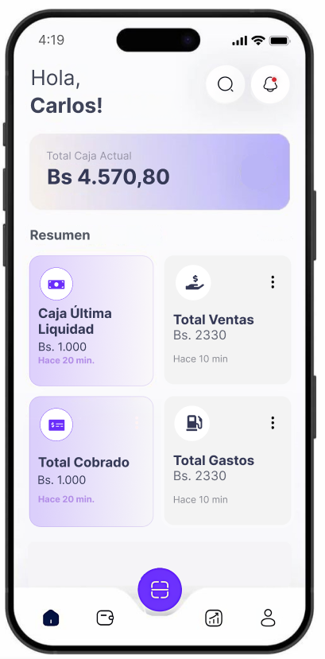

# 💰 Sistema de Cobros y Préstamos

Una aplicación móvil desarrollada en Flutter para la gestión eficiente de cobros y préstamos, diseñada para una pequeña empresa dedicada al rubro. (Aún en Desarrollo)

## 📱 Características Principales

- **Sistema de Autenticación Seguro**: Login con validación de credenciales
- **Dashboard Intuitivo**: Visualización clara del balance total y resumen financiero
- **Gestión de Cobros**: Control detallado de pagos pendientes y realizados
- **Administración de Préstamos**: Seguimiento completo del ciclo de préstamos
- **Interfaz Moderna**: Diseño limpio y fácil de usar
- **Multiplataforma**: Compatible con Android, iOS, Web y Desktop

## 🚀 Tecnologías Utilizadas

- **Framework**: Flutter 3.x
- **Lenguaje**: Dart
- **Arquitectura**: Clean Architecture con separación por features
- **Estado**: StatefulWidget y setState (próximamente Provider/Bloc)
- **Navegación**: Navigator 2.0
- **Diseño**: Material Design 3

## 📁 Estructura del Proyecto

```
lib/
├── features/
│   ├── auth/                    # Módulo de autenticación
│   │   ├── data/               # Repositorios y fuentes de datos
│   │   ├── domain/             # Entidades y lógica de negocio
│   │   └── presentation/       # UI y widgets
│   └── dashboard/              # Módulo del dashboard principal
│       └── presentation/       # Pantallas y widgets del dashboard
└── main.dart                   # Punto de entrada de la aplicación
```

## 🛠️ Instalación y Configuración

### Prerrequisitos

- [Flutter SDK](https://flutter.dev/docs/get-started/install) (versión 3.0 o superior)
- [Dart SDK](https://dart.dev/get-dart) (incluido con Flutter)
- Android Studio / VS Code
- Git

### Pasos de Instalación

1. **Clonar el repositorio**
   ```bash
   git clone https://github.com/tu-usuario/cobrosyprestamos.git
   cd cobrosyprestamos
   ```

2. **Instalar dependencias**
   ```bash
   flutter pub get
   ```

3. **Verificar configuración de Flutter**
   ```bash
   flutter doctor
   ```

4. **Ejecutar la aplicación**
   ```bash
   # Para desarrollo
   flutter run
   
   # Para web
   flutter run -d chrome
   
   # Para Windows
   flutter run -d windows
   ```

## 👥 Usuarios de Prueba

Para probar la aplicación, puedes usar estas credenciales:

| Usuario | Contraseña | Nombre Completo |
|---------|------------|-----------------|
| `joel` | `1234567` | Joel |
| `carlos` | `1234567` | Carlos Enrique |

## 📸 Capturas de Pantalla

<!--### Pantalla de Login
-->

### Dashboard Principal


*Nota: Agrega tus capturas de pantalla en la carpeta `docs/images/`*

## 🏗️ Arquitectura

La aplicación sigue los principios de **Clean Architecture** organizando el código en capas:

- **Presentation**: Widgets, páginas y lógica de UI
- **Domain**: Entidades de negocio y casos de uso
- **Data**: Repositorios, APIs y fuentes de datos

Cada feature es independiente y mantiene su propia estructura interna.

## 🔮 Roadmap

### Próximas Funcionalidades

- [ ] **Gestión de Clientes**: CRUD completo de clientes
- [ ] **Histórial de Transacciones**: Registro detallado de movimientos
- [ ] **Reportes y Estadísticas**: Gráficos y análisis financiero
- [ ] **Notificaciones**: Recordatorios de cobros pendientes
- [ ] **Backup en la Nube**: Sincronización con Firebase/Supabase
- [ ] **Calculadora de Intereses**: Herramienta integrada
- [ ] **Exportación de Datos**: PDF y Excel
- [ ] **Tema Oscuro**: Modo nocturno
- [ ] **Autenticación Biométrica**: Huella dactilar/Face ID

### Mejoras Técnicas

- [ ] **Estado Global**: Implementación de Provider/Bloc
- [ ] **Base de Datos**: Migración a SQLite/Hive
- [ ] **Testing**: Unit tests y Widget tests
- [ ] **CI/CD**: GitHub Actions para automatización
- [ ] **Internacionalización**: Soporte multi-idioma

## 🤝 Contribuciones

¡Las contribuciones son bienvenidas! Por favor:

1. Fork el proyecto
2. Crea una rama para tu feature (`git checkout -b feature/nueva-funcionalidad`)
3. Commit tus cambios (`git commit -m 'Agregar nueva funcionalidad'`)
4. Push a la rama (`git push origin feature/nueva-funcionalidad`)
5. Abre un Pull Request

<!--## 📄 Licencia

Este proyecto está bajo la licencia MIT. Ver el archivo [LICENSE](LICENSE) para más detalles.-->

## 👨‍💻 Desarrollador

**Tu Nombre**
- GitHub: [@tu-usuario](https://github.com/Grillo26)
- LinkedIn: [Tu Perfil](https://www.linkedin.com/in/carlosenriquemamani/)
- Email: carlsenrmt26@gmail.com

---

⭐ Si este proyecto te ha sido útil, ¡no olvides darle una estrella en GitHub!
